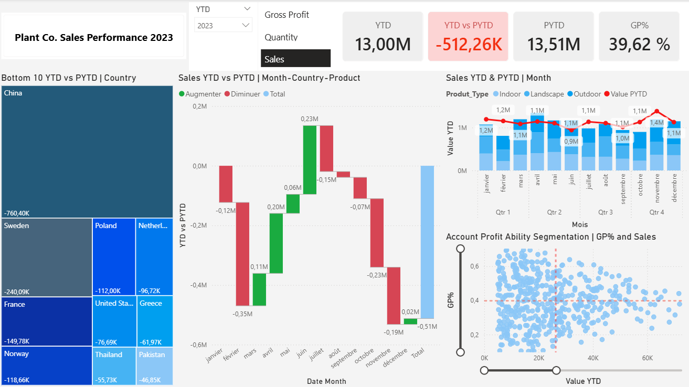
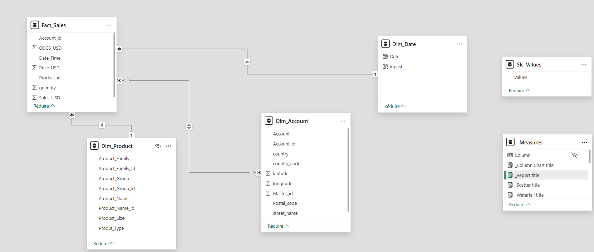
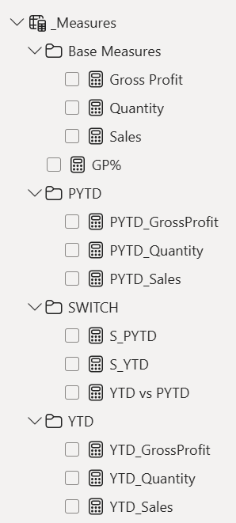

# Power BI Sales Performance Dashboard

## Project Description
This Power BI project analyzes sales performance using key indicators such as **Sales, Quantity, and Gross Profit**, leveraging **time intelligence (YTD / PYTD)** and a **dynamic user experience** powered by SWITCH measures.

The dashboard enables users to:
- track cumulative yearly performance (YTD),
- compare results with the same period of the previous year (PYTD),
- dynamically switch displayed metrics via slicers,
- analyze sales by product, customer, country, and time.

---

## Dashboard Overview

Main dashboard showing KPIs, YTD vs PYTD analysis, product performance, and geographic distribution.

---

## Data Modeling

The model follows a **Star Schema architecture**, aligned with Power BI best practices.

### Data Model Diagram

### Fact Table
**Fact_Sales**
- Sales_USD
- Quantity
- COGS_USD
- Date_Time
- Product_id
- Account_id

Contains transactional sales data.

### Dimension Tables
**Dim_Date**
- Date  
- Inpast (boolean flag for valid periods)

**Dim_Product**
- Product_Family  
- Product_Group  
- Product_Type  
- Product_Size  

**Dim_Account**
- Account  
- Country  
- Latitude / Longitude  

Used for filtering, drill-down, and business analysis.

### Disconnected Table
**Slc_Values**
- Values (Sales, Quantity, Gross Profit)

Used exclusively to control dynamic measures via SWITCH.

---

## DAX Measures Structure

### Base Measures
- **Sales**
- **Quantity**
- **Gross Profit** (Sales – COGS)
- **GP%** (Gross Profit / Sales)

---

### YTD (Year-To-Date)
- **YTD_Sales**
- **YTD_Quantity**
- **YTD_GrossProfit**

Tracks cumulative performance from the start of the year.

---

### PYTD (Previous Year-To-Date)
- **PYTD_Sales**
- **PYTD_Quantity**
- **PYTD_GrossProfit**

Enables fair comparison with the same period last year.

---

### Dynamic Measures (SWITCH)
- **S_YTD**
- **S_PYTD**
- **YTD vs PYTD**

A single visual dynamically updates based on the selected metric.

---

## Business Objectives
- Monitor sales performance over time
- Identify top and underperforming products and customers
- Compare current performance with the previous year
- Enable faster decision-making through dynamic KPIs

